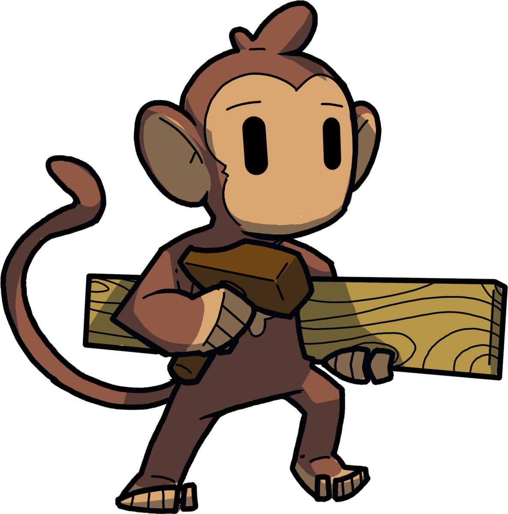

<div align="center" id="top"> 
  

  &#xa0;

</div>

<h1 align="center">Jungle App</h1>

<p align="center">
  

  

  

  

</p>

<!-- Status -->

<h4 align="center"> 
	🚧  Under construction...  🚧
</h4> 

<hr> 

<p align="center">
  <a href="#dart-about">About</a> &#xa0; | &#xa0; 
  <a href="#sparkles-features">Features</a> &#xa0; | &#xa0;
  <a href="#rocket-technologies">Technologies</a> &#xa0; | &#xa0;
  <a href="#white_check_mark-requirements">Requirements</a> &#xa0; | &#xa0;
  <a href="#checkered_flag-starting">Starting</a> &#xa0; | &#xa0;
  <a href="#memo-license">License</a> &#xa0; | &#xa0;
</p>

<br>

## :dart: About ##

Aplikacja projektu jungle ze "zwolnieni z teorii"

## :sparkles: Features ##

:heavy_check_mark: Feature 1 : Miernik wody <- na razie nie za duzo

## :rocket: Technologies ##

The following tools were used in this project:

- [Expo](https://expo.io/)
- [Node.js](https://nodejs.org/en/)
- [React](https://pt-br.reactjs.org/)
- [React Native](https://reactnative.dev/)
- [TypeScript](https://www.typescriptlang.org/)

## :white_check_mark: Requirements ##

Before starting :checkered_flag:, you need to have [Git](https://git-scm.com) and [Node](https://nodejs.org/en/) installed.

## :checkered_flag: Starting ##

```bash
# Clone this project
$ git clone https://github.com/Jejis06/jungle_app

# Access
$ cd jungle_app

# Install dependencies and Initialize project
$ npm install
$ expo install

# Run the project
$ npx expo start

```

## :memo: License ##

NOT COMPLETE - NO LICENSE


Made with :heart: by <a href="https://github.com/Jejis06" target="_blank">Jejis06</a> and <a href="https://github.com/fuzzyduck10394" target="_blank">fuzzyduck10394</a>

&#xa0;

<a href="#top">Back to top</a>
